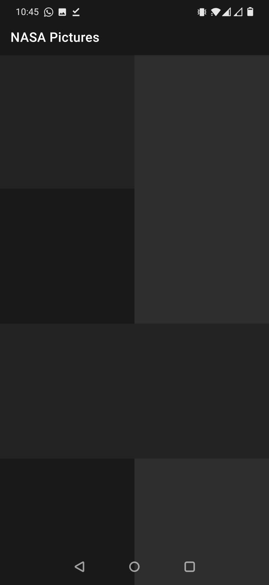
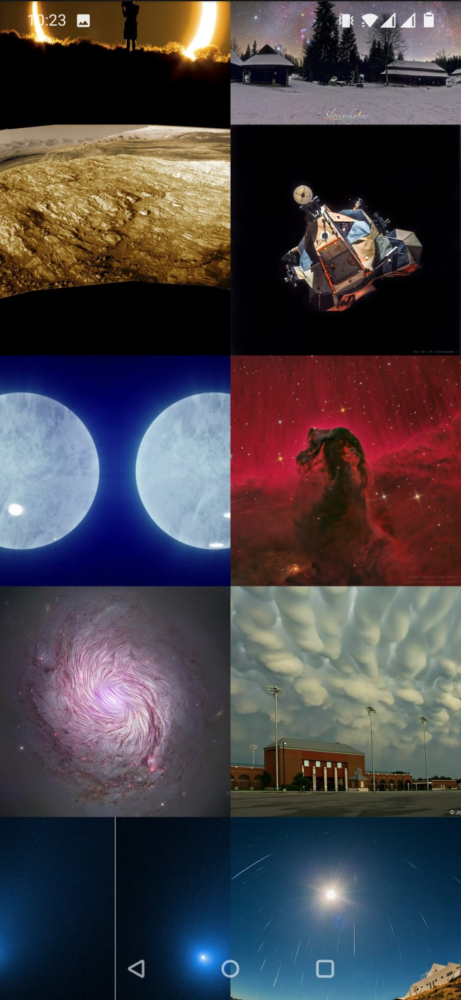
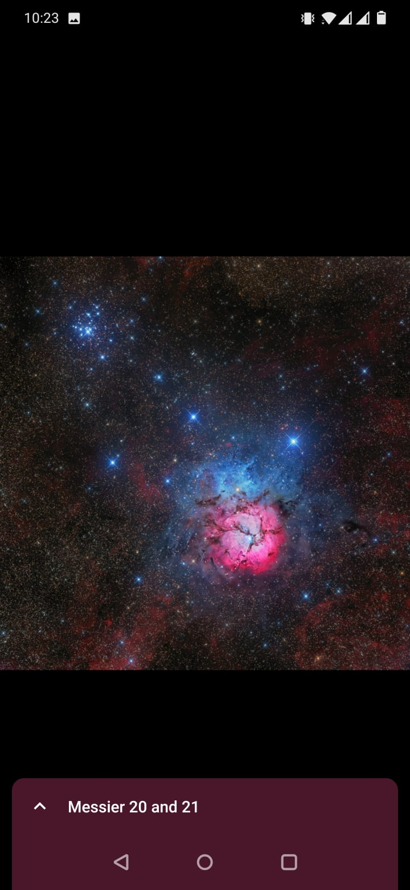
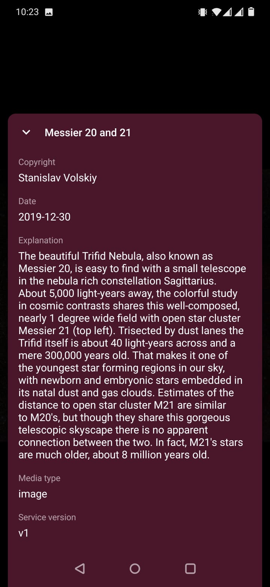

# NASAPictures
An Android app that will let the user browse through a list of images parsed from a JSON file

# Dark theme
https://www.youtube.com/watch?v=8ZMvKcnjUT8

# Light theme
https://www.youtube.com/watch?v=4fF_9bEveiY

# Screenshots
<table style="width:100%">
  <tr>
    <td></td>
    <td></td>
    <td></td>
    <td></td>
  </tr>
</table>
